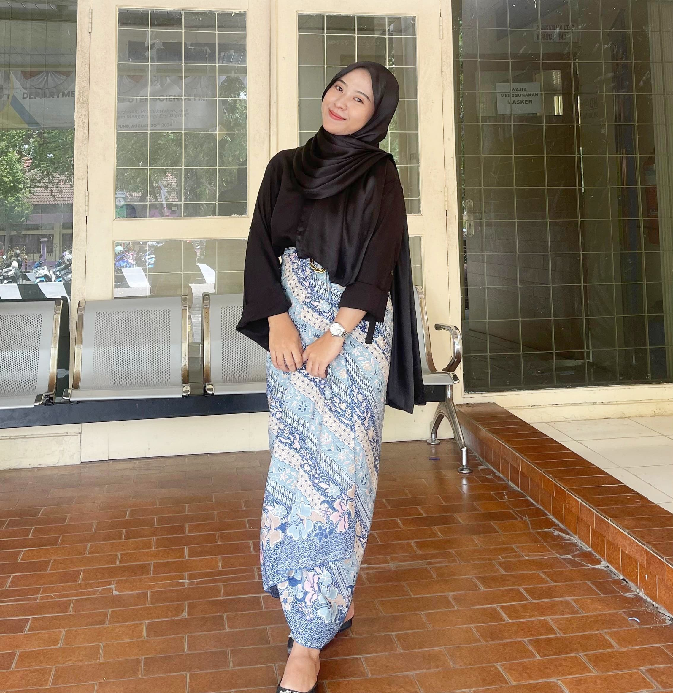

<link rel="stylesheet" href="style.css">


# 🏥 MedicMate: Sistem Pakar Diagnosis Penyakit Menular

## 📋 Deskripsi Proyek

MedicMate adalah aplikasi web inovatif berbasis sistem pakar yang dirancang untuk mendiagnosis penyakit menular menggunakan metode **Forward Chaining** dan **Certainty Factor**.

## ✨ Fitur Utama

- Diagnosis penyakit menular otomatis
- Akurasi tinggi menggunakan metode forward chaining
- Antarmuka user-friendly
- Berbasis web responsif

## 🛠️  Teknologi yang Digunakan

# 🏥 MedicMate: Sistem Pakar Diagnosis Penyakit Menular


## 👥 Tim Pengembang

### 1. Kyla Nisrina Anggrahini

**NPM:** 2267051002

### 2. Rhalasya Eleina Putri

**NPM:** 2217051083

### 3. Annisa Citra Pratiwi

**NPM:** 2217051008

### 4. Annisa Miftha Safitri

**NPM:** 2257051022


### Langkah Instalasi

1. Clone Repository

```bash
git https://github.com/kylanisrina/project-sistem-pakar.git
```

3. Jalankan di Web Server Lokal


## 🤝 Kontribusi

Kami terbuka untuk kontribusi! Silakan chat [wa.me/+6281370181649](http://wa.me/+6281370181649) untuk detail lebih lanjut.

---

**Dibuat dengan ❤️ oleh Tim MedicMate**
